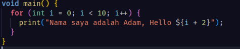
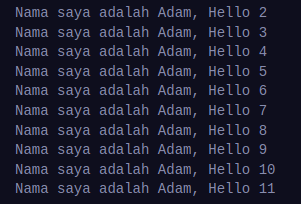
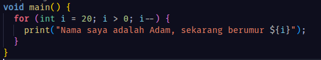
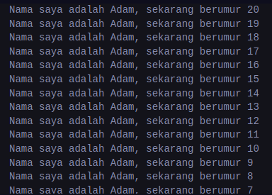

### Soal 1

Modifikasilah kode pada baris 3 di VS Code atau Editor Code favorit Anda berikut ini agar mendapatkan keluaran (output) sesuai yang diminta!

- **kode**
  

- **output**
  

---

- **kode**
  

- **output**
  

---

### Soal 2

Mengapa sangat penting untuk memahami bahasa pemrograman Dart sebelum kita menggunakan framework Flutter ? Jelaskan!

#### Jawab

Karena bahasa pemrograman Dart merupakan bahasa pemrograman yang digunakan pada framework Flutter. Sintaks dan gaya pemrograman pada Flutter juga menggunakan sintaks dan gaya pemrograman Dart. Seperti paradigma reaktivitas, asynchronous, dan state manajemen. Sehingga memahami bahasa pemorgraman Dart sangat penting ketika kita akan menggunakan framework Flutter.

---

### Soal 3

Rangkumlah materi dari codelab ini menjadi poin-poin penting yang dapat Anda gunakan untuk membantu proses pengembangan aplikasi mobile menggunakan framework Flutter.

- Bahasa Dart adalah inti dari framework Flutter
- Dart merupakan bahasa pemrograman high level yang mengadopsi Object Oriented Programming (OOP)
- Dart mempunyai beberapa fitur-fitur sebagai berikut:
  - Productive tooling
  - Garbage Collector
  - Type annotations
  - Statically typed
  - Portability
- Dart dibuat untuk menawarkan performa terbaik, fleksibel, kuat dan alat yang baik dalam pengembangan berskala besar
- Dart mengeksekusi kode dengan dua cara yaitu:
  - Dart virtual machines (VMs)
  - JavaScript compilations (dart2js)
- Eksekusi kode pada Dart dapat beroperasi pada 2 mode yaitu:
  - Kompilasi Just-in-Time (JIT)
  - Kompilasi Ahead-of-TIme (AOT)
- Struktur bahasa pemrograman DART seperti gabungan antara Java dan Javascript. Dart berorientasi objek dan memiliki berbagai macam operator (arithmetic, equality, relational, increment, decrement, dan logical)
- Dart menggunakan function atau method yang digunakan untuk memisahkan kode dengan penulisan sebagai berikut

  > void main() {
  > ...
  > }

- Dartpad merupakan online code editor yang dapat digunakan untuk mengeksekusi kode program Dart secara online
