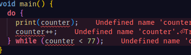
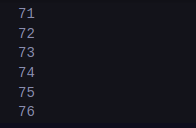

# Praktikum 1

## **Langkah 1:**

Ketik atau salin kode program berikut ke dalam fungsi `main()`.

    String test = "test2";
    if (test == "test1") {
       print("Test1");
    } else If (test == "test2") {
       print("Test2");
    } Else {
       print("Something else");
    }

    if (test == "test2") print("Test2 again");

## **Langkah 2:**

Silakan coba eksekusi (Run) kode pada langkah 1 tersebut. Apa yang terjadi? Jelaskan!

Hasil ekesekusi kode program diatas menghasilkan error seperti gambar diatas. Hal ini dikarenakan kode tersebut terdapat huruf besar.

---

Jika kita memperbaiki kode program dengan mengubah huruf besarnya menjadi huruf kecil maka kode akan berjalan seperti gambar diatas.

## **Langkah 3:**

Tambahkan kode program berikut, lalu coba eksekusi (Run) kode Anda.

    String test = "true";
    if (test) {
       print("Kebenaran");
    }

Apa yang terjadi ? Jika terjadi error, silakan perbaiki namun tetap menggunakan if/else.

Hasil dari ekesekusi program diatas akan menghasilkan error seperti seperti berikut :

Dimana variable test yang telah dideklarasikan, dideklarasikan kembali. Error yang kedua adalah fungsi if harus memiiliki argument yang bertipe bool.

---

kita mengganti nama variabel test menjadi test2 dan menambahkan perkondisian pada fungsi if. Hasilnya sebagai berikut:

---

# Praktikum 2

## **Langkah 1:**

Ketik atau salin kode program berikut ke dalam fungsi `main()`.

    while (counter < 33) {
      print(counter);
      counter++;
    }

## **Langkah 2:**

Silakan coba eksekusi (Run) kode pada langkah 1 tersebut. Apa yang terjadi? Jelaskan! Lalu perbaiki jika terjadi error.

> Hasil eksekusi kode tersebut akan menghasilkan error Undefined variable 'counter' dimana variable counter belum dideklarasikan.
>
> #### error
>
> 
>
> ---
>
> Kita dapat memperbaiki kode program tersebut dengan mendeklarasikan variable counter.
>
> #### kode program
>
> 
>
> #### hasil runnging
>
> 

## **Langkah 3:**

Tambahkan kode program berikut, lalu coba eksekusi (Run) kode Anda.

    do {
      print(counter);
      counter++;
    } while (counter < 77);

Apa yang terjadi ? Jika terjadi error, silakan perbaiki namun tetap menggunakan _do-while_.

> Tidak terjadi error tetapi perulangan hanya terjadi sekali tidak 2 kali.

# Praktikum 3

## **Langkah 1:**

Ketik atau salin kode program berikut ke dalam fungsi `main()`.

    for (Index = 10; index < 27; index) {
      print(Index);
    }

## **Langkah 2:**

Silakan coba eksekusi (Run) kode pada langkah 1 tersebut. Apa yang terjadi? Jelaskan! Lalu perbaiki jika terjadi error.

Eksekusi program diatas akan mengahsilkan error sebagai berikut :

Dimana terjadi karena penggunaan huruf besar dan juga variabel index tidak didkelarasikan pada fungsi for. Tedapat juga kesalahan pada increment dimana index tidak diincrement sehingga akan menghasilkan infinite loop.

Berikut adalah kode yang telah diperbaiki:

## **Langkah 3:**

Tambahkan kode program berikut di dalam _for-loop_, lalu coba eksekusi (Run) kode Anda.

    If (Index == 21) break;
    Else If (index > 1 || index < 7) continue;
    print(index);

Apa yang terjadi ? Jika terjadi error, silakan perbaiki namun tetap menggunakan _for_ dan _break-continue_.

Eksekusi dari kode program diatas akan menghasilkan output kosong. Untuk memperbaiki tersebut kita bisa mengubah operator or pada menjadi operator and pada else if continue.

# Tugas

1.  Silakan selesaikan Praktikum 1 sampai 3, lalu dokumentasikan berupa screenshot hasil pekerjaan beserta penjelasannya!
2.  Buatlah sebuah program yang dapat menampilkan bilangan prima dari angka 0 sampai 201 menggunakan Dart. Ketika bilangan prima ditemukan, maka tampilkan nama lengkap dan NIM Anda.

- Kode Program
  
- Hasil Eksekusi
  

3.  Kumpulkan berupa link commit repo GitHub pada tautan yang telah disediakan di grup Telegram!
