# Tugas Praktikum

1. Silakan selesaikan Praktikum 1 sampai 5, lalu dokumentasikan berupa screenshot hasil pekerjaan Anda beserta penjelasannya!
2. Jelaskan yang dimaksud Functions dalam bahasa Dart!
3. Jelaskan jenis-jenis parameter di Functions beserta contoh sintaksnya!
4. Jelaskan maksud Functions sebagai first-class objects beserta contoh sintaknya!
   Apa itu Anonymous Functions? Jelaskan dan berikan contohnya!
5. Jelaskan perbedaan Lexical scope dan Lexical closures! Berikan contohnya!
6. Jelaskan dengan contoh cara membuat return multiple value di Functions!
7. Kumpulkan berupa link commit repo GitHub pada tautan yang telah disediakan di grup Telegram!

## Tugas 1

### Praktikum 1: Eksperimen Tipe Data List

- Langkah 1:
  Ketik atau salin kode program berikut ke dalam void main().

```dart
var list = [1, 2, 3];
assert(list.length == 3);
assert(list[1] == 2);
print(list.length);
print(list[1]);

list[1] = 1;
assert(list[1] == 1);
print(list[1]);
```

- Langkah 2:
  Silakan coba eksekusi (Run) kode pada langkah 1 tersebut. Apa yang terjadi? Jelaskan!

> Eksekusi kode tersebut akan menampilkan panjang list, element list index ke-1, dan element list index ke-1 yang telah diassign menjadi 1

- Langkah 3:
  Ubah kode pada langkah 1 menjadi variabel final yang mempunyai index = 5 dengan default value = null. Isilah nama dan NIM Anda pada elemen index ke-1 dan ke-2. Lalu print dan capture hasilnya.

```dart
void main(){
  var list2 = List<String?>.filled(5, null);
  list2[1] = "Adam Rafi Rezandi";
  list2[2] = "2141720185";
  print(list2[1]);
  print(list2[2]);
}
```

> 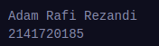

### Praktikum 2: Eksperimen Tipe Data Set

- Langkah 1:
  Ketik atau salin kode program berikut ke dalam fungsi main().

```dart
void main() {
  var halogens = {'fluorine', 'chlorine', 'bromine', 'iodine', 'astatine'};
  print(halogens);
}
```

> 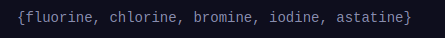

- Langkah 2:
  Silakan coba eksekusi (Run) kode pada langkah 1 tersebut. Apa yang terjadi? Jelaskan! Lalu perbaiki jika terjadi error.

> Eksekusi kode program a kan mengeluarakan isi set halogens.

- Langkah 3:
  Tambahkan kode program berikut, lalu coba eksekusi (Run) kode Anda.

```dart
var names1 = <String>{};
Set<String> names2 = {}; // This works, too.
var names3 = {}; // Creates a map, not a set.

print(names1);
print(names2);
print(names3);
```

> 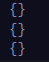

- Menambahkan runtimeType pada print

```dart
print(names1.runtimeType);
print(names2.runtimeType);
print(names3.runtimeType);
```

> 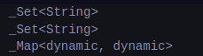

Apa yang terjadi ? Jika terjadi error, silakan perbaiki namun tetap menggunakan ketiga variabel tersebut. Tambahkan elemen nama dan NIM Anda pada kedua variabel Set tersebut dengan dua fungsi berbeda yaitu .add() dan .addAll(). Untuk variabel Map dihapus, nanti kita coba di praktikum selanjutnya.

> Hasil eksekusi kode diatas akan menghasilkan 2 set dan 1 map.

```dart
void main() {
  var names1 = <String>{};
  Set<String> names2 = {};

  names1.add("Adam Rafi Rezandi");
  names1.add("2141720185");
  names2.addAll({"Adam Rafi Rezandi", "2141720185"});

  print(names1);
  print(names2);
}
```

> 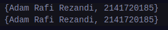

### Praktikum 3: Eksperimen Tipe Data Maps

#### Langkah 1:

Ketik atau salin kode program berikut ke dalam fungsi main().

```dart
void main() {
  var gifts = {
// Key: Value
    'first': 'partridge',
    'second': 'turtledoves',
    'fifth': 1
  };

  var nobleGases = {
    2: 'helium',
    10: 'neon',
    18: 2,
  };

  print(gifts);
  print(nobleGases);
}
```

> 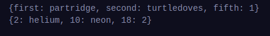

#### Langkah 2:

Silakan coba eksekusi (Run) kode pada langkah 1 tersebut. Apa yang terjadi? Jelaskan! Lalu perbaiki jika terjadi error.

> Hasil eksekusi kode diatas mengnampilkan elemen-elemen pada map gifts dan nobleGases.

#### Langkah 3:

Tambahkan kode program berikut, lalu coba eksekusi (Run) kode Anda.

```dart
vvoid main() {
  var gifts = {
// Key: Value
    'first': 'partridge',
    'second': 'turtledoves',
    'fifth': 1
  };

  var nobleGases = {
    2: 'helium',
    10: 'neon',
    18: 2,
  };
  var mhs1 = Map<String, String>();
  gifts['first'] = 'partridge';
  gifts['second'] = 'turtledoves';
  gifts['fifth'] = 'golden rings';

  var mhs2 = Map<int, String>();
  nobleGases[2] = 'helium';
  nobleGases[10] = 'neon';
  nobleGases[18] = 'argon';

  print(gifts);
  print(nobleGases);
}
```

> 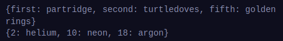

Apa yang terjadi ? Jika terjadi error, silakan perbaiki.

> Yang terjadi adalah value dari map gifts dengan key _fifth_ diassign menjadi 'golden rings' dan value dari key 18 pada map nobleGases diassign dari 2 menjadi 'argon'.

Tambahkan elemen nama dan NIM Anda pada tiap variabel di atas (gifts, nobleGases, mhs1, dan mhs2). Dokumentasikan hasilnya dan buat laporannya!

```dart
void main() {
  var gifts = {
// Key: Value
    'first': 'partridge',
    'second': 'turtledoves',
    'fifth': 1
  };

  var nobleGases = {
    2: 'helium',
    10: 'neon',
    18: 2,
  };
  var mhs1 = Map<String, String>();
  gifts['first'] = 'partridge';
  gifts['second'] = 'turtledoves';
  gifts['fifth'] = 'golden rings';

  var mhs2 = Map<int, String>();
  nobleGases[2] = 'helium';
  nobleGases[10] = 'neon';
  nobleGases[18] = 'argon';

  gifts['nama'] = "Adam Rafi Rezandi";
  gifts['nim'] = "2141720185";
  nobleGases[3] = "Adam Rafi Rezandi";
  nobleGases[4] = "2141720185";
  mhs1['nama'] = "Adam Rafi Rezandi";
  mhs1['nim'] = "2141720185";
  mhs2[0] = "Adam Rafi Rezandi";
  mhs2[1] = "2141720185";

  print(gifts);
  print(nobleGases);
  print(mhs1);
  print(mhs2);
}

```

> 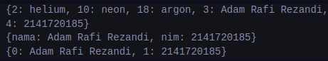

### Praktikum 4: Eksperimen Tipe Data List: Spread dan Control-flow Operators

#### Langkah 1:

Ketik atau salin kode program berikut ke dalam fungsi main().

```dart
var list = [1, 2, 3];
var list2 = [0, ...list];
print(list1);
print(list2);
print(list2.length);
```

> 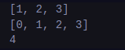

#### Langkah 2:

Silakan coba eksekusi (Run) kode pada langkah 1 tersebut. Apa yang terjadi? Jelaskan! Lalu perbaiki jika terjadi error.

> Error pada kode print yang memanggil list1. Untuk memperbaikinya kita dapat mengganti nama variabel 'list' menjadi 'list1' atau mengganti argumen pada print.

```dart
void main() {
  var list1 = [1, 2, 3];
  var list2 = [0, ...list1];
  print(list1);
  print(list2);
  print(list2.length);
}
```

#### Langkah 3:

Tambahkan kode program berikut, lalu coba eksekusi (Run) kode Anda.

```dart
void main() {
  var list1 = [1, 2, 3];
  var list2 = [0, ...list1];
  list1 = [1, 2, null];
  print(list1);
  var list3 = [0, ...?list1];
  print(list3.length);
  print(list2);
  print(list2.length);
}

```

Apa yang terjadi ? Jika terjadi error, silakan perbaiki.

> Akan terjadi error karena mengassign elemen null pada list1, kita dapat menggantinya dengan nilai 0.

```dart
void main() {
  var list1 = [1, 2, 3];
  var list2 = [0, ...list1];
  list1 = [1, 2, 0];
  print(list1);
  var list3 = [0, ...?list1];
  print(list3.length);
  print(list2);
  print(list2.length);
}
```

Tambahkan variabel list berisi NIM Anda menggunakan Spread Operators. Dokumentasikan hasilnya dan buat laporannya!

```dart
void main() {
  var nim = ["2141720185"];
  var dataDiri = ["Adam Rafi Rezandi", ...nim];
  print(dataDiri);
}
```

> 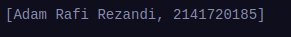

#### Langkah 4:

Tambahkan kode program berikut, lalu coba eksekusi (Run) kode Anda.

```dart
void fun3() {
  var nav = ['Home', 'Furniture', 'Plants', if (promoActive) 'Outlet'];
  print(nav);
}
```

Apa yang terjadi ? Jika terjadi error, silakan perbaiki. Tunjukkan hasilnya jika variabel promoActive ketika true dan false.

> Terjadi error dikarenakan variabel promoActive belum terdefinisikan.

```dart
void fun3() {
  bool promoActive=true; // true or false
  var nav = ['Home', 'Furniture', 'Plants', if (promoActive) 'Outlet'];
  print(nav);
}
```

- Jika promoActive = true

> 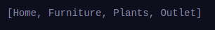

- Jika pormoActive = false

> 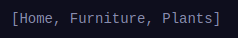

#### Langkah 5:

Tambahkan kode program berikut, lalu coba eksekusi (Run) kode Anda.

```dart
void fun4() {
  var nav2 = [
    'Home',
    'Furniture',
    'Plants',
    if (login case 'Manager') 'Inventory'
  ];
  print(nav2);
}
```

Apa yang terjadi ? Jika terjadi error, silakan perbaiki. Tunjukkan hasilnya jika variabel login mempunyai kondisi lain.

> Terjadi error dikarenakan variabel login belum terdefinisikan.

```dart
void fun4() {
  String login = 'Manager';
  var nav2 = [
    'Home',
    'Furniture',
    'Plants',
    if (login case 'Manager') 'Inventory'
  ];
  print(nav2);
}
```

- Jika variable login = "Manager"

> 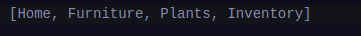

- Jika variable login = "Pegawai"

> 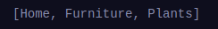

#### Langkah 6:

Tambahkan kode program berikut, lalu coba eksekusi (Run) kode Anda.

```dart
void fun5() {
  var listOfInts = [1, 2, 3];
  var listOfStrings = ['#0', for (var i in listOfInts) '#$i'];
  assert(listOfStrings[1] == '#1');
  print(listOfStrings);
}

```

Apa yang terjadi ? Jika terjadi error, silakan perbaiki. Jelaskan manfaat Collection For dan dokumentasikan hasilnya.

> Hasil eksekusi kode diatas menghasilkan output sebagai berikut.<br> > 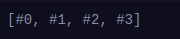<br>
> Manfaat dari Collection For sendiri untuk memudahkan perulangan pada collection dan menghindari kesalahan diluar collection itu karena scopenya terbatas pada collection tersebut.

### 5: Eksperimen Tipe Data Records

#### Langkah 1:

Ketik atau salin kode program berikut ke dalam fungsi main().

```dart
var record = ('first', a: 2, b: true, 'last');
print(record)
```

#### Langkah 2:

Silakan coba eksekusi (Run) kode pada langkah 1 tersebut. Apa yang terjadi? Jelaskan! Lalu perbaiki jika terjadi error.

> Error karena kurang titik koma pada pemanggulan fungsi print.

```dart
void fun1() {
  var record = ('first', a: 2, b: true, 'last');
  print(record);
}
```

> 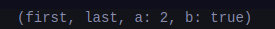<br>
> Hasil eksekusi kode teresebut akan menampilkan elemen-elemen pada record.

#### Langkah 3:

Tambahkan kode program berikut di luar scope void main(), lalu coba eksekusi (Run) kode Anda.

(int, int) tukar((int, int) record) {
var (a, b) = record;
return (b, a);
}
Apa yang terjadi ? Jika terjadi error, silakan perbaiki. Gunakan fungsi tukar() di dalam main() sehingga tampak jelas proses pertukaran value field di dalam Records.

> Kita mendefinisikan variabel tukar pada luar main. Ketika kita mengakses variabel tukar pada main terjadi error karena ketidak cocokan tipe data parameter dengan argumen yang kita berikan.

```dart
void main() {
  var record = ('first', a: 2, b: true, 'last');
  print(tukar(record));
  print(record);
}

(int, bool) tukar((String, String, {int a, bool b}) record) {
  var (a, b) = (record.b, record.a);
  return (b, a);
}
```

> 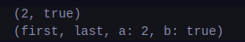<br>
> Nah kita dapat memperbaiki tipe data pada parameter tukar dan tipe return pada fungsi tukar seperti kode diatas.

#### Langkah 4:

Tambahkan kode program berikut di dalam scope void main(), lalu coba eksekusi (Run) kode Anda.

```dart
void main() {
  var record = ('first', a: 2, b: true, 'last');
  print(tukar(record));
  print(record);

  (String, int) mahasiswa;
  print(mahasiswa);
}
```

Apa yang terjadi ? Jika terjadi error, silakan perbaiki. Inisialisasi field nama dan NIM Anda pada variabel record mahasiswa di atas. Dokumentasikan hasilnya dan buat laporannya!

> Akan terjadi error dikarenakan variabel mahasiswa belum diinisialisasikan dengan value.

```dart
void main() {
  var record = ('first', a: 2, b: true, 'last');
  print(tukar(record));
  print(record);

  (String, int) mahasiswa = ('Adam Rafi Rezandi', 2141720185);
  print(mahasiswa);
}
```

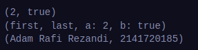

> Pada kode diatas kita menginisialisasikan record mahasiswa dengan Nama(String) dan nim(int).<br>

#### Langkah 5:

Tambahkan kode program berikut di dalam scope void main(), lalu coba eksekusi (Run) kode Anda.

```dart
void main() {
  var record = ('first', a: 2, b: true, 'last');
  print(tukar(record));
  print(record);

  (String, int) mahasiswa = ('Adam Rafi Rezandi', 2141720185);
  print(mahasiswa);

  var mahasiswa2 = ('Adam Rafi Rezandi', a: 2141720185, b: true, 'last');

  print(mahasiswa2.$1); // Prints 'Adam Rafi Rezandi'
  print(mahasiswa2.a); // Prints 2141720185
  print(mahasiswa2.b); // Prints true
  print(mahasiswa2.$2); // Prints 'last'
}
```

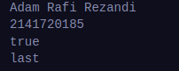

Apa yang terjadi ? Jika terjadi error, silakan perbaiki. Gantilah salah satu isi record dengan nama dan NIM Anda, lalu dokumentasikan hasilnya dan buat laporannya!

## Tugas 2

Functions dalam bahasa Dart adalah blok kode yang dapat ditambahkan argumen dan parameter dan dapat dieksekusi berulang kali tanpa harus menulis ulang kodenya.

## Tugas 3

- Parameter wajib

```dart
void fun(params){
  ...
}

fun(args)
```

- Parameter default

```dart
void fun(params="default"){
  ...
}

fun(args) // or fun()
```

- Parameter named

```dart
void fun(param1,param2){
  ...
}

fun(param1:arg,param2:arg)

```

- Parameter rest

```dart
void fun(...params){
  ...
}

fun(arg1,arg2,arg3)

```

## Tugas 4

Functions sebagai first-class objects di Dart berarti functions diperlakukan sebagai objek biasa yang bisa digunakan sebagai parameter fungsi, nilai balik fungsi, dan disimpan di variable atau properties.

- Function dapat disimpan sebagai variable

```dart
void main() {
  var greet = () => print("Hello");

  greet();
}
```

- Function sebagai parameter function

```dart
void sayHello(Function greeting) {
  greeting();
}

void main() {
  sayHello(() => print("Hello"));
}

```

- Function sebagai return function

```dart
Function getGreeting() {
  return () => print("Hello");
}

void main() {
  getGreeting()();
}
```

## Tugas 5

Anonymous function adalah function yang tidak memiliki nama.

```dart
void sayHello(Function greeting) {
  greeting();
}

void main() {
  // dapat dipanggil langsung
  (() => print("Hello"))();
  // argumen dari function
  sayHello(() => print("Hai"));
}

```

## Tugas 6

**Lexical Scope** menentukan akses variable berdarkan blok keberadaannya, dimana variable tersebut hanya dapat diakses oleh blok deklarasinya dan childnya.

```dart
bool topLevel = true;

void main() {
  var insideMain = true;

  void myFunction() {
    var insideFunction = true;

    void nestedFunction() {
      var insideNestedFunction = true;

      assert(topLevel);
      assert(insideMain);
      assert(insideFunction);
      assert(insideNestedFunction);
    }
  }
}
```

**Lexical Closure** memiliki akses ke parent scope-nya meski function tersebut dieksekusi di luar scope asalnya.

```dart
// Returns a function that adds [addBy] to the
/// function's argument.
Function makeAdder(int addBy) {
  return (int i) => addBy + i;
}

void main() {
  // Create a function that adds 2.
  var add2 = makeAdder(2);

  // Create a function that adds 4.
  var add4 = makeAdder(4);

  assert(add2(3) == 5);
  assert(add4(3) == 7);
}
```

## Tugas 7

- Return null

```dart
foo() {}

assert(foo() == null);
```

- Return satu value

```dart
foo() {
  return true;
}

assert(foo() == true);
```

- Return multiple values (collection)

```dart
(String, int) foo() {
  return ('something', 42);
}
```

- l
-
