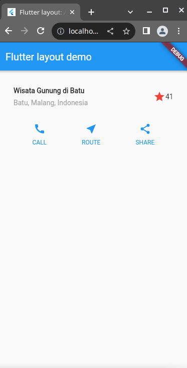
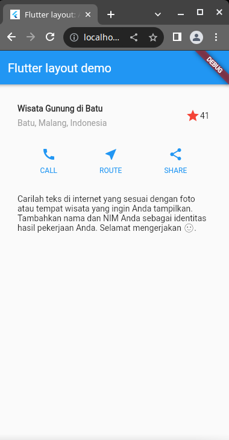

# Tugas Praktikum

1. Selesaikan Praktikum 1 sampai 3, lalu dokumentasikan dan push ke repository Anda berupa screenshot setiap hasil pekerjaan beserta penjelasannya di file README.md!
2. Kumpulkan link commit repository GitHub Anda ke spreadsheet yang telah disediakan!

## Tugas 1

### Praktikum 1

**Hasil Praktikum**

### Praktikum 2

**Hasil Praktikum**

### Praktikum 3

**Hasil Praktikum**

## Tugas 2

Selesai
