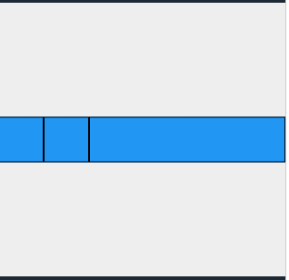

# Tugas Praktikum

1. Selesaikan Praktikum 1 sampai 3, lalu dokumentasikan dan push ke repository Anda berupa screenshot setiap hasil pekerjaan beserta penjelasannya di file README.md!
2. Kumpulkan link commit repository GitHub Anda ke spreadsheet yang telah disediakan!

## Tugas 1

### Praktikum 1

layout_flutter

[https://jti-polinema.github.io/flutter-codelab/07-layout-navigasi/#0](https://jti-polinema.github.io/flutter-codelab/07-layout-navigasi/#0)

Menambahkan title row
**Hasil Praktikum**

### Praktikum 2

Menambahkan button row
**Hasil Praktikum**

### Praktikum 3

Menambahkan deskripsi
**Hasil Praktikum**

### Praktikum 4

Menambahkan gambar
**Hasil Praktikum**

## Tugas 2

basic_layout_flutter
[https://docs.flutter.dev/codelabs/layout-basics](https://docs.flutter.dev/codelabs/layout-basics)

### Axis size and alignment

- mainAxisSize

  Menentukan seberapa banyak ruang yang bisa digunakan oleh component.

  - max
    

  - min
    

- mainAxisAlignment

  Menentukan bagaimana posisi berada component.

  - start 

  - end 

- crossAxisAlignment

  Menentukan bagaimana posisi berada component pada posisi bersilangan.

  - center 

  - start 

### Flexible widget

Digunakan untuk memberikan fleksibilitas kepada children terhadap parent widget.

- Tidak menggunakan Flexible untuk kotak ke-1
- FlexFix.tight untuk kotak ke-2
- FlexFit.loose untuk kotak ke-3
  

### Expanded widget

Digunakan untuk memberikan fleksibilitas kepada children untuk mengisi ruang pada parent.

- Kotak ke-1 dan ke-2 tidak menggunakan widget Expanded
- Kotak ke-3 menggunakan widget Expanded
  

### SizedBox widget

Digunakan untuk memberikan ukuran widget yang sesuai dengan lebar dan tinggi yang telah ditentukan.

- Kotak ke-1 dan ke-2 tidak menggunakan widget SizedBox
- Kotak ke-3 menggunakan widget SizedBox
  
- SizedBox juga digunakan untuk memberikan space antar widget
  

### Spacer widget

Sama seperti widget SizedBox yang digunakan untuk memberikan jarak antar widget

- Memberikan jarak antar widget yang flexible
  

### Text widget

Digunakan untuk menampilkan text

- Menampilkan text dengan berbagai opsi seperti fon family, font size, dan color
  

### Icon widget

Digunakan untuk menampilkan icon

- Menampilkan icon dengan opsi jenis icon, ukuran, dan warna
  

### Image widget

Digunakan untuk menampilkan gambar

- Jika gambar tidak berhasil diload
  
- Jika gambar berhasil diload
  

### Putting it all together

Membuat layout seperti ini

Hasil

