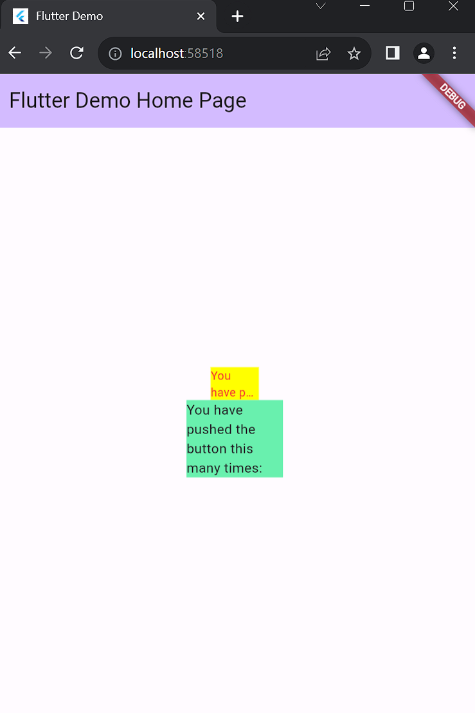

1. Selesaikan Praktikum tersebut, lalu dokumentasikan dan push ke repository Anda berupa screenshot
   hasil pekerjaan beserta penjelasannya di file README.md!
   > 
2. Jelaskan maksud dari langkah 2 pada praktikum tersebut!
   > Langkah 2 pada praktikum tersebut adalah untuk menambahkan package `auto_size_text` pada project agar dapat digunakan pada project.
3. Jelaskan maksud dari langkah 5 pada praktikum tersebut!
   > Langkah 5 pada praktikum tersebut adalah untuk menambahkan parameter pada widget `RedTextWidget` dengan parameter `text`
4. Pada langkah 6 terdapat dua widget yang ditambahkan, jelaskan fungsi dan perbedaannya!
   > Dua widget yang ditambahkan memiliki fungsi untuk menampilkan text pada container dengan perbedannya pada widget pertama memiliki `width 50` sedangkan pada widget kedua memiliki `width 100` sehingga pada widget kedua text yang ditampilkan akan lebih besar dibandingkan dengan widget pertama menyesuaikan dengan besar containernya.
5. Jelaskan maksud dari tiap parameter yang ada di dalam plugin auto_size_text berdasarkan tautan pada dokumentasi ini !
   > Terdapat parameter yang telah diisi pada widget sebagai berikut :
   >
   > - `text` : untuk menampilkan text pada widget
   > - `style` : untuk menentukan style dari text yang ditampilkan
   > - `maxLines` : untuk menentukan jumlah baris maksimal yang dapat ditampilkan
   > - `overflow` : untuk menentukan overflow dari text yang ditampilkan dengan tanda `...` jika terjadi overflow
6. Kumpulkan laporan praktikum Anda berupa link repository GitHub ke spreadsheet yang telah disediakan!
