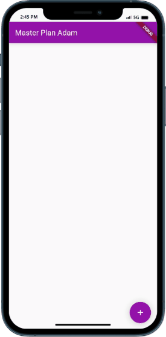

# Tugas Praktikum 1 - Dasar State dengan Model-View

1. Selesaikan langkah-langkah praktikum tersebut, lalu dokumentasikan berupa GIF hasil akhir praktikum beserta penjelasannya di file README.md!
   
2. Jelaskan maksud dari langkah 4 pada praktikum tersebut! Mengapa dilakukan demikian?

   > Langkah 4 berfungsi untuk mengekspor kode pada `plan.dart` dan `task.dart` sehingga pada `plan_screen.dart` hanya mengimport file `data_layer.dart` saja untuk mengimpor kedua file tersebut.

3. Mengapa perlu variabel plan di langkah 6 pada praktikum tersebut? Mengapa dibuat konstanta ?
   > Variabel `plan` digunakan untuk menginisialisasikan class `Plan` yang telah dibuat pada `plan.dart`. Konstanta digunakan agar variabel tersebut tidak dapat diubah nilainya.
4. Lakukan capture hasil dari Langkah 9 berupa GIF, kemudian jelaskan apa yang telah Anda buat!
   > 
   >
   > Disini saya sudah membuat `todo list app` yang dapat menambahkan dan menghapus task.
5. Apa kegunaan method pada Langkah 11 dan 13 dalam lifecyle state ?
   > Fungsi `initstate` digunakan untuk menginisialisasi state pada widget. Fungsi `dispose` digunakan untuk membersihkan state pada widget.
6. Kumpulkan laporan praktikum Anda berupa link commit atau repository GitHub ke spreadsheet yang telah disediakan!
