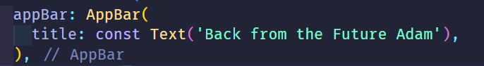
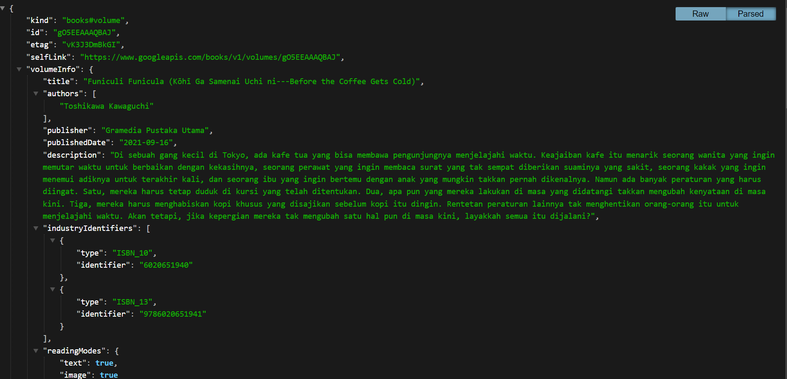
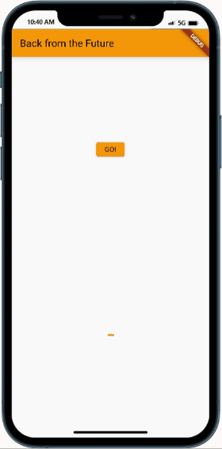
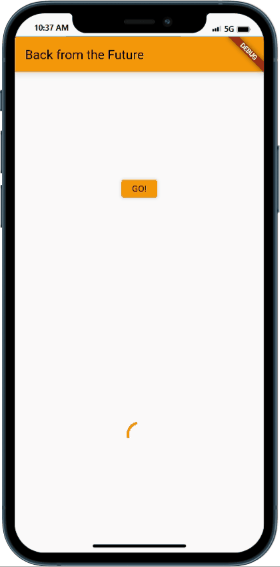
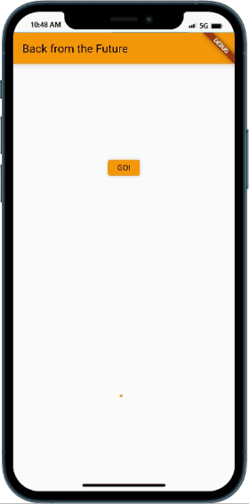
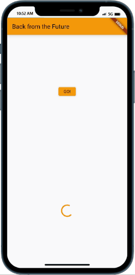
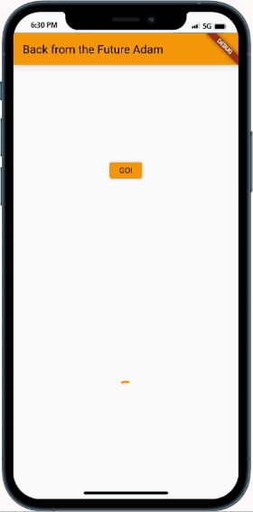

## Praktikum 1: Mengunduh Data dari Web Service (API)

### Soal

1. Tambahkan nama panggilan Anda pada title app sebagai identitas hasil pekerjaan Anda.
   >  > 
2. Carilah judul buku favorit Anda di Google Books, lalu ganti ID buku pada variabel path di kode tersebut. Caranya ambil di URL browser Anda seperti gambar berikut ini.
   > 
   > Kemudian cobalah akses di browser URI tersebut dengan lengkap seperti ini. Jika menampilkan data JSON, maka Anda telah berhasil. Lakukan capture milik Anda dan tulis di README pada laporan praktikum. Lalu lakukan commit dengan pesan "W12: Soal 2".
   > 
3. Jelaskan maksud kode langkah 5 tersebut terkait substring dan catchError!
   Capture hasil praktikum Anda berupa GIF dan lampirkan di README. Lalu lakukan commit dengan pesan "W12: Soal 3".
   >   
   > `Substring` pada kode tersebut berfungsi untuk mengambil teks dari index 0 sampai 450. Sedangkan `catchError` berfungsi untuk menangkap error yang terjadi pada kode tersebut.

## Praktikum 2: Menggunakan await/async untuk menghindari callbacks

4. Jelaskan maksud kode langkah 1 dan 2 tersebut!
   Capture hasil praktikum Anda berupa GIF dan lampirkan di README. Lalu lakukan commit dengan pesan "W12: Soal 4".

   > 
   > Pada langkah 1 kita menginisialisasikan 3 method dengan menggunakan fungsi `Future`.delayed dengan lama 3 detik dengan return nilai tertentu. Nah pada langkah ke 2 kita menginisialiasasikan method `count()` yang digunakan untuk memanggil ketiga method sebelumnya dan mengganti variable result dengan jumlah nilai kembali dari ketiga method tersebut.

## Praktikum 3: Menggunakan Completer di Future

5. Jelaskan maksud kode langkah 2 tersebut!
   Capture hasil praktikum Anda berupa GIF dan lampirkan di README. Lalu lakukan commit dengan pesan "W12: Soal 5".

   > 

> Fungsi kode langkah 2 adalah untuk menginisialisasikan `Completer` untuk mengembalikan nilai hasil `Future` nantinnya.

6. Jelaskan maksud perbedaan kode langkah 2 dengan langkah 5-6 tersebut!
   Capture hasil praktikum Anda berupa GIF dan lampirkan di README. Lalu lakukan commit dengan pesan "W12: Soal 6".
   > 
   > Perbedaan dari kedua kode tersebut adalah `Completer` akan mengembalikan status `Future` apakah berhasil atau tidak sedangkan `Async Await` mengembalikan hasil `Future` pada fungsi tersebut.

## Praktikum 4: Memanggil Future secara paralel

7. Capture hasil praktikum Anda berupa GIF dan lampirkan di README. Lalu lakukan commit dengan pesan "W12: Soal 7".

   > 

8. Jelaskan maksud perbedaan kode langkah 1 dan 4!

> Perbedaannya pada kode langkah satu FutureGroup menggunakan dari package async sedangkakan future.wait menggunakan dari package dart:async.

## Praktikum 5: Menangani Respon Error pada Async Code

9. Capture hasil praktikum Anda berupa GIF dan lampirkan di README. Lalu lakukan commit dengan pesan "W12: Soal 9".

10. Panggil method handleError() tersebut di ElevatedButton, lalu run. Apa hasilnya? Jelaskan perbedaan kode langkah 1 dan 4!

## Praktikum 6: Menggunakan Future dengan StatefulWidget

11. Tambahkan nama panggilan Anda pada tiap properti title sebagai identitas pekerjaan Anda.
12. Jika Anda tidak melihat animasi loading tampil, kemungkinan itu berjalan sangat cepat. Tambahkan delay pada method getPosition() dengan kode await Future.delayed(const Duration(seconds: 3));
    Apakah Anda mendapatkan koordinat GPS ketika run di browser? Mengapa demikian?
    Capture hasil praktikum Anda berupa GIF dan lampirkan di README. Lalu lakukan commit dengan pesan "W12: Soal 12".
