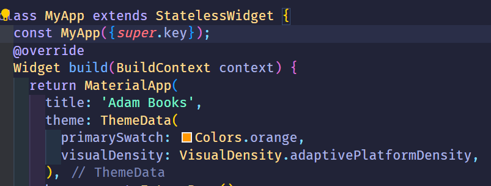

## Praktikum 1: Mengunduh Data dari Web Service (API)

### Soal

1. Tambahkan nama panggilan Anda pada title app sebagai identitas hasil pekerjaan Anda.
   > 
2. Carilah judul buku favorit Anda di Google Books, lalu ganti ID buku pada variabel path di kode tersebut. Caranya ambil di URL browser Anda seperti gambar berikut ini.
   
   Kemudian cobalah akses di browser URI tersebut dengan lengkap seperti ini. Jika menampilkan data JSON, maka Anda telah berhasil. Lakukan capture milik Anda dan tulis di README pada laporan praktikum. Lalu lakukan commit dengan pesan "W12: Soal 2".
   
3. elaskan maksud kode langkah 5 tersebut terkait substring dan catchError!
   Capture hasil praktikum Anda berupa GIF dan lampirkan di README. Lalu lakukan commit dengan pesan "W12: Soal 3".

4.
5.
