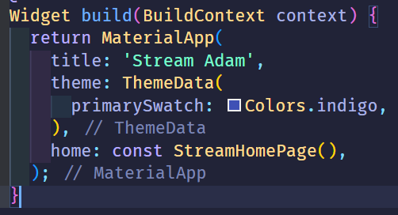
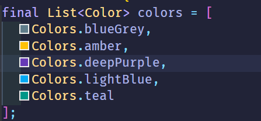
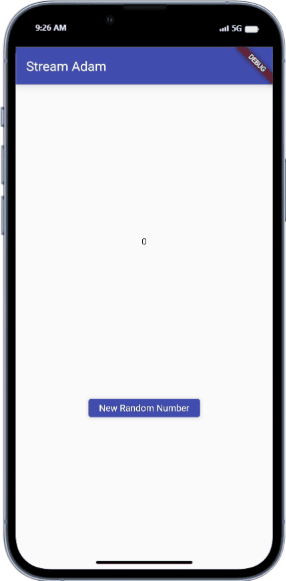
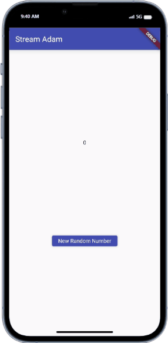
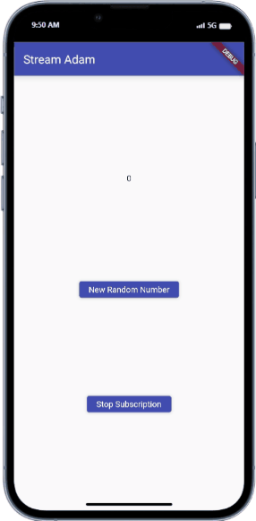
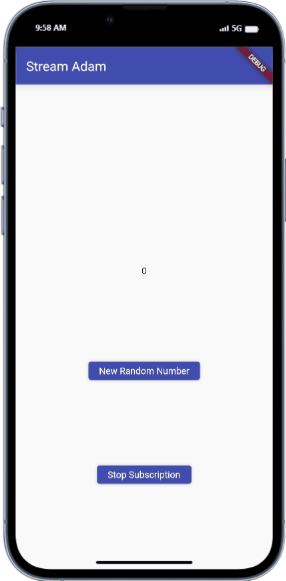

# Praktikum 1: Dart Streams

1. Tambahkan nama panggilan Anda pada title app sebagai identitas hasil pekerjaan Anda.
   Gantilah warna tema aplikasi sesuai kesukaan Anda.
   Lakukan commit hasil jawaban Soal 1 dengan pesan "W13: Jawaban Soal 1"

   > 

2. Tambahkan 5 warna lainnya sesuai keinginan Anda pada variabel colors tersebut.
   Lakukan commit hasil jawaban Soal 2 dengan pesan "W13: Jawaban Soal 2"

   > 

3. Jelaskan fungsi keyword yield\* pada kode tersebut!
   Apa maksud isi perintah kode tersebut?
   Lakukan commit hasil jawaban Soal 3 dengan pesan "W13: Jawaban Soal 3"

   > Keyword `yield*` digunakan untuk mengembalikan banyak nilai secara berurut dari fungsi Streams. Pada kode tersebut fungsi `yield*` digunakan untuk mengembalikan nilai dari fungsi `getColors()`.

4. Capture hasil praktikum Anda berupa GIF dan lampirkan di README.
   Lakukan commit hasil jawaban Soal 4 dengan pesan "W13: Jawaban Soal 4"

   > 

5. Jelaskan perbedaan menggunakan listen dan await for (langkah 9) !
   Lakukan commit hasil jawaban Soal 5 dengan pesan "W13: Jawaban Soal 5"

   > Perbedaannya adalah ketika terdapat perintah berikutnya `await for` akan menunggu stream untuk selesai. Sedangkan `listen` bisa mengekseskusi perintah lanjut seperti method-chaining.

# Praktikum 2: Stream controllers dan sinks

6. Jelaskan maksud kode langkah 8 dan 10 tersebut!
   Capture hasil praktikum Anda berupa GIF dan lampirkan di README.
   Lalu lakukan commit dengan pesan "W13: Jawaban Soal 6".

   > 
   > Pada Langkah 8 digunakan untuk menginisialiasi `stream` baru yakni `NumberStream`. Sedangkan pada langkah 10 digunakan untuk mengenerate random number lalu menambahkannya ke `stream` menggunakan `sink.add()`.

7. Jelaskan maksud kode langkah 13 sampai 15 tersebut!
   Kembalikan kode seperti semula pada Langkah 15, comment addError() agar Anda dapat melanjutkan ke praktikum 3 berikutnya.
   Lalu lakukan commit dengan pesan "W13: Jawaban Soal 7".
   > Kode langkah 13 sampai 15 digunakan untuk menghandle error pada `stream` melalui fungsi `addError()` pada stream. WKode `onError()` digunakan untuk menghandle error `stream`. Sedangkan `numberStream.addError()` digunakan untuk menginisialisasi error pada `stream`.

# Praktikum 3: Injeksi data ke streams

8. Jelaskan maksud kode langkah 1-3 tersebut!
   Capture hasil praktikum Anda berupa GIF dan lampirkan di README.
   Lalu lakukan commit dengan pesan "W13: Jawaban Soal 8".
   > 
   > Maksud dari kode langkah 1-3 digunakanan untuk merubah data pada saat `stream`. Nah pada kode tersebut `number` akan dikalikan `10` apabila mendapatkan data dan bernilai `-1` apabila terjadi error.

# Praktikum 4: Subscribe ke stream events

9. Jelaskan maksud kode langkah 2, 6 dan 8 tersebut!
   Capture hasil praktikum Anda berupa GIF dan lampirkan di README.
   Lalu lakukan commit dengan pesan "W13: Jawaban Soal 9".
   > 
   > Fungsi dari langkah 2 untuk menginisialisasi stream.
   > Fungsi dari langkah 6 untuk mengehntikan streaming menerima data
   > Fungsi dari langkah 8 untuk menginisilaisasi nilai random dan menghandle error pada stream.

# Praktikum 5: Multiple stream subscriptions

10. Jelaskan mengapa error itu bisa terjadi ?
    > Error terjadi karena stream telan menghandle satu `listener` yaitu `subscription`, tetapi `subscription2` mencoba untuk listen maka akan menghasilkan error.
11. Jelaskan mengapa hal itu bisa terjadi ?
    Capture hasil praktikum Anda berupa GIF dan lampirkan di README.
    Lalu lakukan commit dengan pesan "W13: Jawaban Soal 10,11".
    > 
    > Hal itu terjadi karena terdapat dua listeners yang berbeda yaitu `subscription` dan `subscription2` yang menghandle stream yang sama sehingga akan `values` akan diubah oleh dua `listener` tersebut yang pada kasus ini perubahannya sama.
